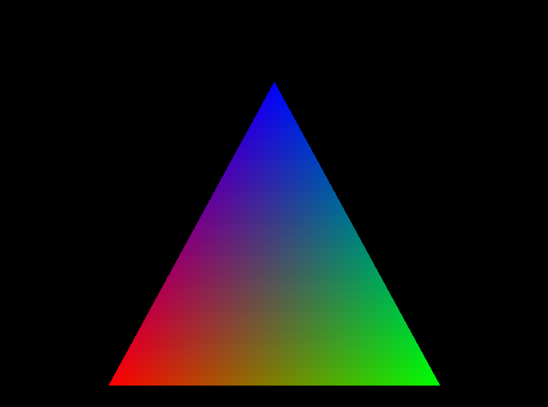
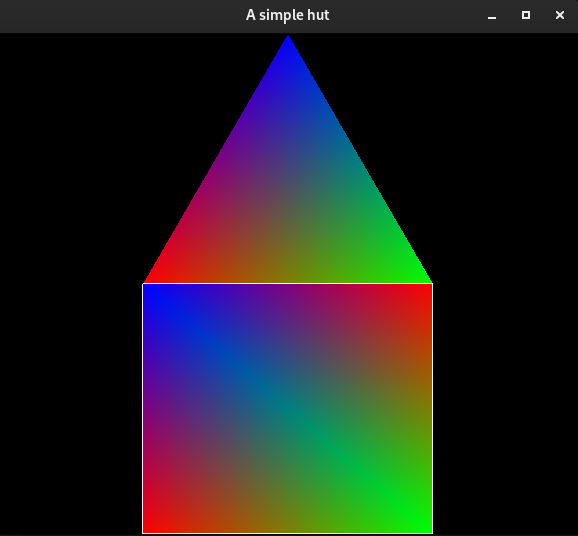

# Triangle graphic
A simple triangle graphic implemented using c++ and the OpenGl library

# How to use
<ul>
<li>Clone the repo onto your local computer</li>
<li>Ensure OpenGl is installed on your system</li>
<li>Run the following commands
    
`$ gcc -o main main.cpp -lGL -lGLU -lglut -lstdc++`   
`$ ./main`

</li>
<li>
    Enjoy
</li>

 

<ul>
